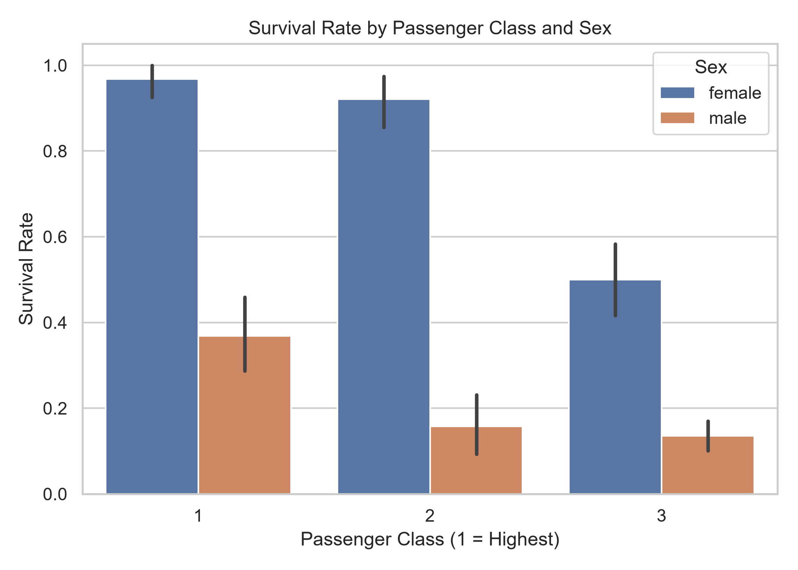
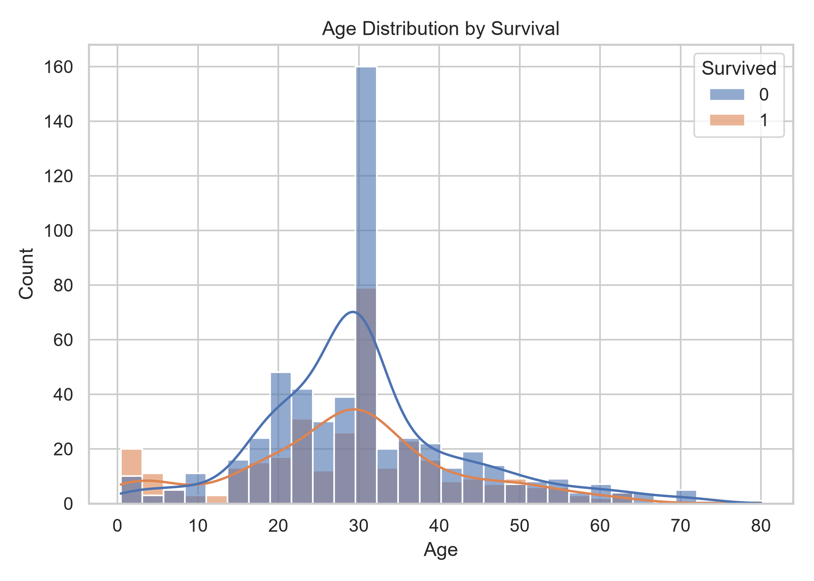
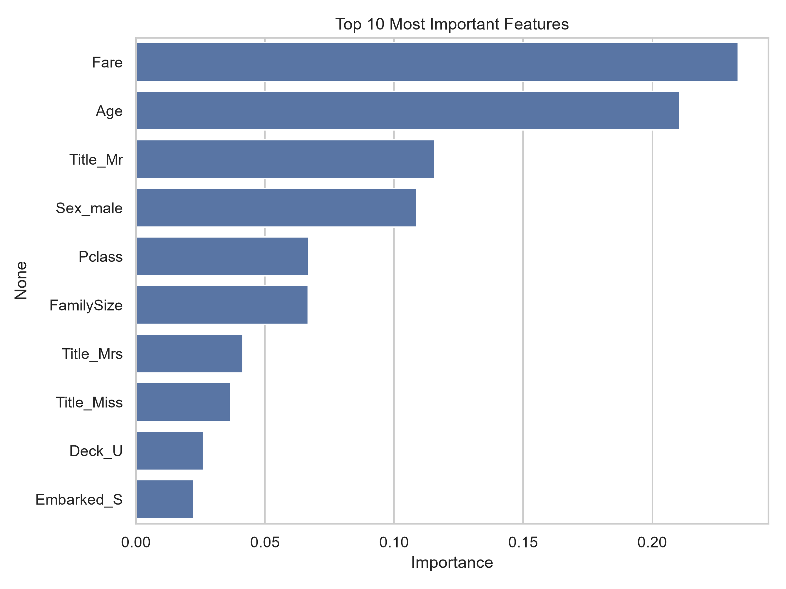

# 🚢 Titanic Survival Prediction

An end-to-end machine learning project predicting passenger survival on the Titanic, using data cleaning, feature engineering, exploratory data analysis, and a Random Forest classifier.

## 📊 Overview

This project walks through the full data science pipeline:
- Cleaning and handling missing data
- Engineering new features (Family Size, Title extraction, Deck)
- Exploratory Data Analysis (EDA) with visualizations
- Training a Random Forest Classifier
- Evaluating model performance
- Generating predictions for Kaggle submission

**Dataset:** [Titanic - Machine Learning from Disaster](https://www.kaggle.com/competitions/titanic) (Kaggle)

## 🛠️ Tech Stack

- Python
- Pandas, NumPy
- Matplotlib, Seaborn
- Scikit-learn (Random Forest Classifier)

## 🔑 Key Steps

1. **Data Cleaning** — filled missing values in `Age`, `Embarked`, and `Cabin`
2. **Feature Engineering:**
   - `FamilySize` = SibSp + Parch + 1
   - `IsAlone` — flag for solo travelers
   - `Title` — extracted from passenger names (Mr, Mrs, Miss, Rare, etc.)
   - `Deck` — extracted from Cabin
3. **EDA** — visualized survival rate by class/sex, age distribution, and feature correlations
4. **Model Training** — Random Forest Classifier (100 estimators)
5. **Evaluation** — accuracy, classification report, confusion matrix, feature importance

## 📈 Results

- **Validation Accuracy:** 81%
- Strongest predictors of survival: **Passenger Class, Sex, and Title**

## 📷 Visualizations

| Survival by Class & Sex | Age Distribution | Feature Importance |
|---|---|---|
|  |  |  |

## 🚀 How to Run

```bash
pip install pandas matplotlib seaborn scikit-learn
python titanic_project.py
```

Update the file paths in the script (`train.csv`, `test.csv`) to match your local dataset location.

## 📁 Project Structure

```
├── titanic_project.py       # Main pipeline script
├── README.md                  # Project documentation
├── survival_by_class_sex.png  # EDA visualization
├── age_distribution.png       # EDA visualization
├── correlation_heatmap.png    # EDA visualization
├── confusion_matrix.png       # Model evaluation
├── feature_importance.png     # Model evaluation
└── submission.csv              # Kaggle submission file
```

## 🙋‍♂️ Author

Feel free to connect or reach out with feedback!
